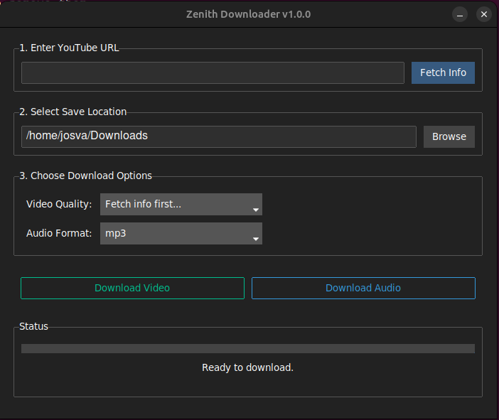

### Instructions

1.  Create a new file named `README.md` in the root of your `youtube_downloader/` project directory.
2.  Copy and paste the entire content below into that file.

---

# Zenith Downloader - Python YouTube Video & Audio Downloader


*(Note: You can take a screenshot of the running application and save it as `screenshot.png` inside the `assets` folder to have it appear here.)*

Zenith Downloader is a cross-platform desktop application built with Python for downloading YouTube videos and extracting audio. It provides a clean, user-friendly graphical interface (GUI) and uses the powerful `yt-dlp` library as its backend to handle the download logic.

The application is designed to be simple, efficient, and reliable for downloading single video links.

## Features

### Core Features
- **Modern GUI:** Built with Tkinter and styled with ttkbootstrap for a modern, dark-themed look.
- **Video Downloads:** Download videos in various available quality formats.
- **Audio Extraction:** Extract and save audio in either **MP3** or **WAV** format.
- **Save Path Selection:** Easily choose where to save your files using a file browser.
- **Graphical Progress Bar:** Real-time visual feedback on download progress, speed, and ETA.
- **User-Friendly Error Handling:** Clear messages for invalid links or failed downloads.
- **Cross-Platform:** Works on Windows, macOS, and Linux.

### Extra Features
- **Clipboard Detection:** Automatically pastes a valid YouTube link from your clipboard when you focus on the URL field.
- **Default Settings:** Remembers a default download path for convenience.
- **`yt-dlp` Updater:** Automatically checks for and applies updates to the `yt-dlp` backend on startup to ensure compatibility with YouTube's latest changes.

---

## How It Works (Architecture)

The project is designed with a modular structure to separate concerns and make the code easy to maintain.

-   **`gui/`**: Contains all the front-end code. `app_gui.py` is responsible for building the window, laying out the widgets, and handling user events (button clicks, etc.).
-   **`core/`**: The brain of the application. `downloader.py` is a wrapper around the `yt-dlp` library, containing all the logic for fetching video information, downloading videos, and extracting audio.
-   **`utils/`**: A collection of helper modules for tasks like file management, clipboard access, and managing settings.
-   **Threading:** To prevent the GUI from freezing during a download (which can take a long time), all network-related tasks (fetching info, downloading) are run in separate background threads. The application uses Tkinter's `root.after()` method to safely send progress updates from the background thread back to the main GUI thread.

---

## Installation and Setup Guide

Follow the instructions specific to your operating system.

### **Prerequisites for All Systems**

1.  **Python 3.7+:** You must have Python installed. You can download it from [python.org](https://www.python.org/downloads/). During installation on Windows, make sure to check the box that says **"Add Python to PATH"**.

2.  **FFmpeg:** This is **required** for converting downloads into audio formats like MP3 and WAV.
    -   **Windows:**
        1.  Download a build from [ffmpeg.org](https://ffmpeg.org/download.html) (e.g., the "gyan.dev" build is recommended).
        2.  Extract the `.zip` file to a permanent location (e.g., `C:\ffmpeg`).
        3.  Add the `bin` folder from within that directory (e.g., `C:\ffmpeg\bin`) to your system's **PATH environment variable**. This allows the application to find it.
    -   **macOS:**
        Install it easily using Homebrew:
        ```bash
        brew install ffmpeg
        ```
    -   **Ubuntu / Debian Linux:**
        Install it using the system's package manager:
        ```bash
        sudo apt-get update && sudo apt-get install ffmpeg
        ```

---

### **System-Specific Setup Instructions**

#### ► For Ubuntu / Debian Linux Users

1.  **Install `python3-tk` and `git`**
    The `tkinter` GUI library is often not included with Python by default on Linux. Open a terminal and run:
    ```bash
    sudo apt-get update
    sudo apt-get install python3-tk python3-venv git -y
    ```

2.  **Clone the Repository**
    ```bash
    git clone https://github.com/your-username/youtube_downloader.git
    cd youtube_downloader
    ```

3.  **Create and Activate a Virtual Environment**
    ```bash
    python3 -m venv venv
    source venv/bin/activate
    ```

4.  **Install Dependencies**
    ```bash
    pip install -r requirements.txt
    ```

5.  **Run the Application**
    ```bash
    python main.py
    ```

---

#### ► For Windows Users

1.  **Install `git`**
    Download and install Git for Windows from [git-scm.com](https://git-scm.com/).

2.  **Clone the Repository**
    Open **Git Bash** (or Command Prompt) and run:
    ```bash
    git clone https://github.com/your-username/youtube_downloader.git
    cd youtube_downloader
    ```

3.  **Create and Activate a Virtual Environment**
    ```bash
    python -m venv venv
    venv\Scripts\activate
    ```

4.  **Install Dependencies**
    ```bash
    pip install -r requirements.txt
    ```

5.  **Run the Application**
    ```bash
    python main.py
    ```

---

#### ► For macOS Users

1.  **Install `git` (if not already present)**
    Git is typically pre-installed. If not, it will be prompted for installation when you run developer tools, or you can install it with Homebrew: `brew install git`.

2.  **Clone the Repository**
    Open your terminal and run:
    ```bash
    git clone https://github.com/your-username/youtube_downloader.git
    cd youtube_downloader
    ```

3.  **Create and Activate a Virtual Environment**
    ```bash
    python3 -m venv venv
    source venv/bin/activate
    ```

4.  **Install Dependencies**
    ```bash
    pip install -r requirements.txt
    ```

5.  **Run the Application**
    ```bash
    python main.py
    ```

---

## How to Use the Application

1.  **Paste URL:** Copy a YouTube video URL and paste it into the top input field. It may auto-fill if the link is already in your clipboard.
2.  **Fetch Info:** Click the **"Fetch Info"** button. The application will retrieve the video title and available quality formats.
3.  **Select Quality:** Choose your desired video quality from the dropdown menu.
4.  **Select Save Path:** The default is your system's "Downloads" folder. Click **"Browse"** to select a different location.
5.  **Download:**
    -   Click **"Download Video"** to save the video in the selected quality.
    -   Click **"Download Audio"** to extract and save the audio in the selected audio format (MP3 or WAV).
6.  **Monitor Progress:** The progress bar and status message will keep you updated on the download.

## Troubleshooting

-   **`ModuleNotFoundError: No module named 'tkinter'` (Linux):** You did not install the `python3-tk` package. Run `sudo apt-get install python3-tk` and recreate your virtual environment.
-   **"FFmpeg not found" Error:** This means `ffmpeg` is either not installed or not in your system's `PATH`. Please follow the prerequisite instructions for your OS carefully.
-   **Download Fails with an Error:**
    -   Double-check that the YouTube URL is correct and the video is not private or region-locked.
    -   `yt-dlp` updates itself on startup, but a recent YouTube change might have broken functionality. You can try running `pip install --upgrade yt-dlp` in your activated virtual environment.

## License

This project is licensed under the MIT License. See the `LICENSE` file for details.
